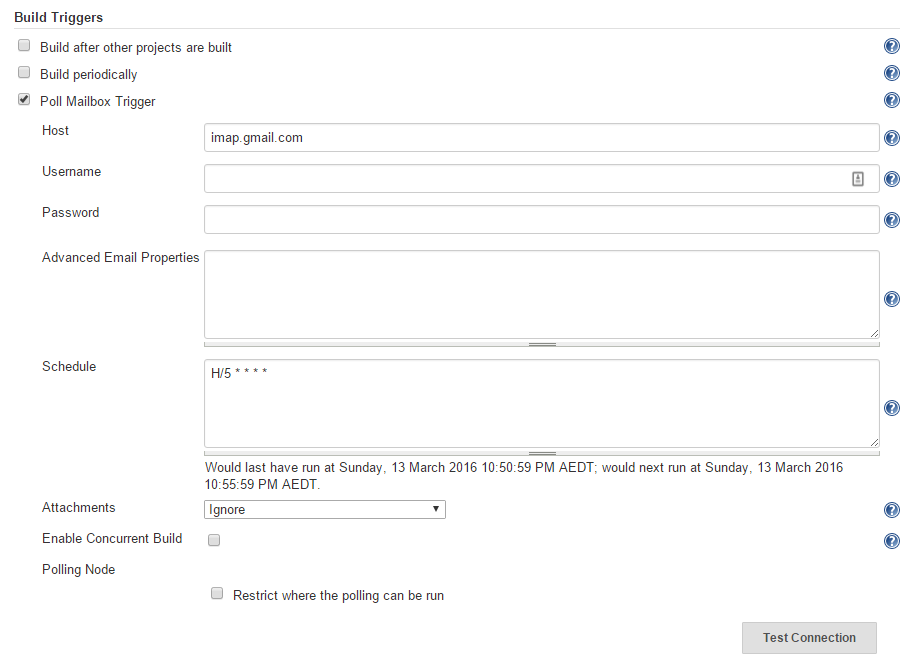

[](https://plugins.jenkins.io/poll-mailbox-trigger-plugin) [](https://travis-ci.org/jenkinsci/poll-mailbox-trigger-plugin) [](https://www.versioneye.com/user/projects/56d76c71d71695003886c352) [](https://codecov.io/github/nickgrealy/poll-mailbox-trigger?branch=master) [](https://gitter.im/jenkinsci/poll-mailbox-trigger-plugin?utm_source=badge&utm_medium=badge&utm_campaign=pr-badge&utm_content=badge)

# Poll Mailbox Trigger Plugin

A Jenkins plugin, to poll an email inbox, and trigger jobs based on new emails.

Table of contents
---

1. [Overview](#overview)
    1. [Usage](#usage)
    1. [Support](#support)
    1. [Rationale](#rationale)
1. [Building](#building)
1. [Screenshots](#screenshots)
1. [Configuration](#configuration)
    1. [GMAIL (IMAPS)](#gmail-imaps)
    1. [GMAIL (POP3S)](#gmail-pop3s)
    1. [HOTMAIL](#hotmail)
    1. [ZIMBRA](#zimbra)
    1. [Office 365](#office-365)
    1. [MS Exchange Server 2013](#ms-exchange-server-2013)
    1. [Want to add a server example](#want-to-add-a-server-example)
1. [Email Conventions](#email-conventions)
1. [Troubleshooting](#troubleshooting)
1. [Want to say thanks?](#want-to-say-thanks)

__Additional:__

1. [Releases / Changelog](https://github.com/jenkinsci/poll-mailbox-trigger-plugin/milestones)
1. [Issues](https://github.com/jenkinsci/poll-mailbox-trigger-plugin/issues)
1. [Wiki](https://wiki.jenkins-ci.org/display/JENKINS/Poll+Mailbox+Trigger+Plugin)
1. [Source Code (GIT)](https://github.com/jenkinsci/poll-mailbox-trigger-plugin.git)
1. [Authors](#authors)
1. [License](#license)

Overview
---

The _poll-mailbox-trigger_ is a Jenkins "build trigger" plugin, which allows a Job to poll an email inbox.
When an unread email is found, that matches the configured criteria, it:

1. marks the email as read, so that it is not reprocessed
1. triggers a new job


### Usage

Once the plugin is installed, you can find it's configuration under **YourJob > Configure > Build Triggers > Poll Mailbox Trigger**.
[You should see something like this screenshot](#screenshots).

From here you can configure:

1. The email server and account to search for UNREAD emails - [here are some sample configurations for popular email services](#sample-configurations)
1. Additional filters, including:
   1. **folder** - the email folder to check (default "INBOX")
   1. **subjectContains** - the email must inlcud this subject (default "jenkins >")
   1. **receivedXMinutesAgo** - the email must have been received within the last X minutes (default "1440" which is 24 hours)
   1. [More configuration information is available here](#configuration)
1. The polling schedule - defaults to every 5 minutes

Once configured, there is an option to **Test Connection**. This will tell you:
1. If there are any errors - [please refer to the Troubleshooting section](#troubleshooting)
1. If the plugin can connect to the mail server successfully
1. How many emails it can find, that match the given criteria

Hit save, and you should be done.
1. There will now be a "View Polling Log" option under your Job, so that you can see when the polling was last checked.
1. The plugin will now start a new job instance, for each unread email it finds. Once an email has triggered a job, the
email will then be marked as READ, so that it doesn't invoke additional job instances in subsequent polling rounds.

### Support

| Compatibility | Since Version |
| --- | --- |
| Java Runtime Environment | 1.7+ |
| Jenkins Server | 2.7.1 LTS |
| Mail Server Protocols | IMAP, IMAPS, POP3, POP3S |

### Rationale

Mainly, because I want to be able to (re)trigger a (failing) build, from the comfort of my home/beach/pub.
I may not always have direct/sychronous access to the build server (due to firewalls, network access, etc).
I'm already being notified by email when a job fails, why can't I just send an email response saying "retry"?

If you're working in a corporate environment, and are lucky enough to have a build server
 there's probably a __very__ small chance that the build server is also exposed to the outside world
 (without using a VPN).

Email is:

1. prevalent - accessible pretty much anywhere
1. convenient - it is built into my mobile phone
1. asychronous - I can fire it now and let it get picked up later
1. adopted - it's already being used to notify me of failed builds

Also, some side notes:

1. I haven't met a Jenkins interface for mobile devices that I like.
1. Email To SMS Gateways exist, for those that don't have Email on their mobile phones.
1. Polling is not ideal

Alternatives to polling?

1. Utilising [Push-IMAP](http://en.wikipedia.org/wiki/Push-IMAP)
1. Installing a sendmail/postfix server, forward emails to it, and write a perl script to process incoming emails.

Building
---

Prerequisites:

- JDK 6 (or above)

To setup for use with Intellij IDEA

```Shell
./gradlew cleanIdea idea
```

To run Jenkins ([http://localhost:8080](http://localhost:8080)) locally with the plugin installed:

```Shell
./gradlew clean server
```

To build the Jenkins plugin (.jpi) file:

```Shell
./gradlew clean jpi
```

To publish/release the Jenkins plugin:

1. Update the `version` in `gradle.properties`, to remove "-SNAPSHOT" (increment and re-add after publishing)
2. Setup the `~/.jenkins-ci.org` credentials file as per the instructions here [https://wiki.jenkins-ci.org/display/JENKINS/Gradle+JPI+Plugin](https://wiki.jenkins-ci.org/display/JENKINS/Gradle+JPI+Plugin)
3. Then run the command:

```Shell
./gradlew clean publish
```

Screenshots
---

_Screenshot - Version 1.022_




Configuration
---

The <i>Host</i> field, allows you to enter the DNS name/hostname/IP Address of the server, hosting the email account service.

The <i>Username</i> field, allows you to enter the username required to connect to this email account.

The <i>Password</i> field, allows you to enter the password (<b>N.B.</b> or application password) required to connect to this email account.

The _Advanced Email Properties_ field, allows you to configure the plugin, using standard key=value property notation.

You can override the following default property values:

    # Connection configuration
    storeName=imaps

    # Search configuration
    folder=INBOX
    subjectContains=jenkins >
    receivedXMinutesAgo=1440

    # JavaMail configuration
    mail.debug=true
    mail.debug.auth=true
    mail.imaps.host=<above_host>
    mail.imaps.port=993

You can also add [java imap properties](https://javamail.java.net/nonav/docs/api/com/sun/mail/imap/package-summary.html),
to further configure the connection.

### Sample Configurations

Below are some sample configurations for common web based email services:

#### GMAIL (IMAPS)
For google passwords, go to "Google account > security > app passwords".

    host=imap.gmail.com
    username=<your_email>@gmail.com
    password=<your_application_password>

#### GMAIL (POP3S)
For google passwords, go to "Google account > security > app passwords".

    host=pop.gmail.com
    username=<your_email>@gmail.com
    password=<your_application_password>
    
    storeName=pop3s

#### HOTMAIL
For hotmail passwords, go to "Account Settings > Security Info > Create a new app password".

    host=imap-mail.outlook.com
    username=<your_email>@hotmail.com
    password=<your_application_password>

#### ZIMBRA
    host=<your_mail_server>
    username=<your_email>
    password=<your_password>

#### [Office 365](#office-365 "Thanks to Jason Swager for this contribution!")
    host=<your_mail_server>
    username=<your_email>
    password=<your_password>
    mail.imap.ssl.enable=true
    mail.imap.starttls.enable=true

#### [MS Exchange Server 2013](#ms-exchange-server-2013 "Thanks to Shaun Alexander for this contribution!")
    host=<your_imap_host_server>
    username=<your_email>
    password=<your_password>
    mail.imaps.port=993
    mail.imap.ssl.enable=true
    mail.imap.starttls.enable=true

#### Want to add a server example?
    If you've managed to successfully setup a connection, 
    please contact me, and I'll update this section.

Email Conventions
---

### Job Parameters

The following build parameters, are injected into the job (sample values provided):

#### From the Incoming Email

|Name             |Sample value                                                |
|-----------------|------------------------------------------------------------|
|pmt_content      |&lt;the email's content&gt;                                 |
|pmt_contentType  |multipart/ALTERNATIVE; boundary=1234                        |
|pmt_flags        |SEEN                                                        |
|pmt_folder       |INBOX                                                       |
|pmt_from         |Me &lt;Sender@gmail.com&gt;                                 |
|pmt_headers      |Delivered-To=Foobar@gmail.com etc                           |
|pmt_messageNumber|14                                                          |
|pmt_receivedDate |2014-10-14T12:19Z                                           |
|pmt_recipients   |Foobar@gmail.com                                            |
|pmt_replyTo      |Me &lt;Sender@gmail.com&gt;                                 |
|pmt_sentDate     |2014-10-14T12:19Z                                           |
|pmt_subject      |Jenkins &gt; My Job                                         |

#### From the poll-mailbox-trigger configuration

|Name                   |Sample value    |
|-----------------------|----------------|
|pmt_mail.debug         |TRUE            |
|pmt_mail.debug.auth    |TRUE            |
|pmt_mail.imaps.host    |imap.gmail.com  |
|pmt_mail.imaps.port    |993             |
|pmt_host               |imap.gmail.com  |
|pmt_username           |Foobar@gmail.com|
|pmt_storeName          |imaps           |
|pmt_receivedXMinutesAgo|1440            |
|pmt_subjectContains    |Jenkins &gt;    |

#### Calculated values (pmt_subject - pmt_subjectContains)

|Name                   |Sample value    |
|-----------------------|----------------|
|pmt_jobTrigger         |My Job          |

N.B. Please note, these variables are injected into the triggered build (only). No other actions (implied or assumed)
are taken. (e.g. No jenkins node filtering is performed, unless you've configured the job to do so. No additional jobs
are triggered, unless you've configured the job to do so. And so on.)

#### Helpful Tips

##### Simple "Retry" email link on failed builds

1. Setup a "Mail Trigger" job, which builds other jobs based on the "pmt_jobTrigger" value.
1. Setup an editable Email notification on the target job, so that it emails you when a job has failed.
1. Include the following html, in the editable Email job configuration.

    `<a href="mailto:<jenkins_poll_mailbox>@gmail.com?subject=Jenkins > $JOB_NAME">Retry $JOB_NAME</a>`

That way, when the job fails, it will email you a nice "Retry My Job" link. Clicking on it, opens a new email, which
you can just send straight away (good for mobile phones).

### Custom Job Parameters

As of version 0.15, you can pass addition custom job parameters to the new build, by simply putting key=value property
notation into the content of your email. N.B. both `text/plain` and `text/html` content types are supported. Emails
with attachments have not yet been tested.

For example:

    Hi Jenkins,

    Please execute the job with these parameters:

    fruit=banana
    veg=carrot
    email=foobar@abc.com

    --
    Kind regards,

    Nick

Will inject the following job parameters into the new job instance:

|Name    | Value           |
|--------|-----------------|
|fruit   | banana          |
|veg     | carrot          |
|email   | foobar@abc.com  |

Troubleshooting
---

###1a. Error : javax.mail.MessagingException: Connection timed out: connect;
###1b. Error : javax.mail.MessagingException: Connection refused;

__Solution:__ Check the Jenkins server can access the email server and port, by running the command (from the Jenkins server):

    telnet <your_host> <your_port_143_or_993>

If you get a message similar to the following, then there is no way to create a direct connection to the mail server - probably
the network is down, or the connection has been (a: passively / b: actively) blocked by a firewall. If so, please check your network settings with
your network administrator. You may need to specify SOCKS proxy details, in the <i>Advanced Email Properties</i>.

    Connecting To imap.gmail.com...Could not open connection to the host, on port 993: Connect failed

###2. Error : javax.mail.AuthenticationFailedException: [AUTHENTICATIONFAILED] Invalid credentials (Failure)

__Solution:__ Check the credentials you're using are correct.

###3. Error: javax.mail.MessagingException: com.ibm.jsse2.util.j: PKIX path building failed: java.security.cert.CertPathBuilderException: PKIXCertPathBuilderImpl could not build a valid CertPath.; ...

__Solution:__ To ignore certificate verification errors, you can use the following config property:

    mail.imaps.ssl.trust=*

__Warning:__ it's not advisable to ignore certificate verification errors (unless perhaps in a test environment): this defeats the point of using SSL/TLS. Instead, if you know you trust that server certificate, import it in your trust store, and specify the location of the trust store using:

    javax.net.ssl.trustStrore=/path/to/cacerts.jks

###4. Error : java.lang.NullPointerException at org.jenkinsci.plugins.pollmailboxtrigger.PollMailboxTrigger.initialiseDefaults(PollMailboxTrigger.java:98)

__Solution:__ I'm not quite sure what the cause is! If you're able to reproduce the issue, please contact me with instructions.
In the meantime, the error is caught and the following message is displayed.

    Could not get Jenkins instance using Jenkins.getInstance() (returns null). This can happen if Jenkins
    has not been started, or was already shut down. Please see
    http://javadoc.jenkins-ci.org/jenkins/model/Jenkins.html#getInstance() for more details. If you believe
    this is an error, please raise an 'issue' under
    https://wiki.jenkins-ci.org/display/JENKINS/poll-mailbox-trigger-plugin.

###5. Error : java.net.UnknownHostException: imaps.gmail.com

__Solution:__ The hostname provided doesn't exist in the DNS servers. Please check that it is correct.

###6. Error : Please set the 'folder=XXX' parameter to one of the following values:

__Solution:__ The provided folder name doesn't exist on the folder, please use one of the values listed.


Want to say thanks?
---

Want to say thanks but can't find the words? [Coffee donations are VERY welcome](http://nickgrealy.github.io/)!


---

Authors
---

Nick Grealy - <nickgrealy@gmail.com>

License
---

Licensed under the [MIT License (MIT)](LICENSE)
